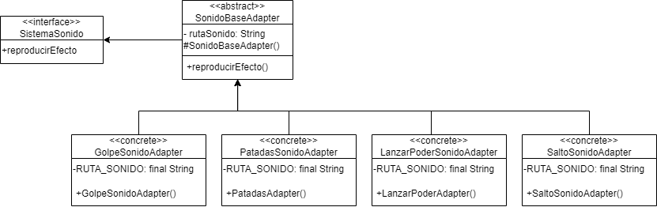
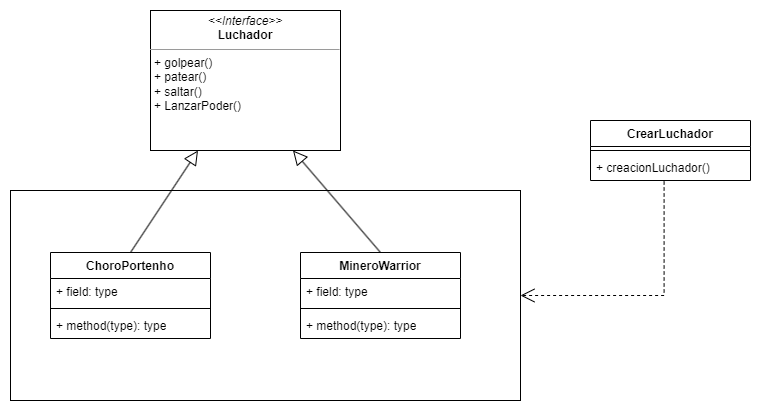

# Metodología de Diseño - Problema 2
## Evaluación
### Objetivo
Evaluar la aplicación de patrones de diseño GOF

### 1. Contexto
#### Patrones de Diseño GOF
##### ¿Qué son?
El patrón de diseño Estrategia es uno de los patrones de diseño conocidos como GoF (de Gang of Four, por sus cuatro creadores: Gamma, Helm, Johnson y Vlissides). Son patrones de diseño orientado a objetos, que encapsulan soluciones a problemas comunes de diseño.

Existen tres tipos de patrones de diseño GoF, que resuelven tres tipos de problema distintos:
- Creacionales, que resuelven problemas de creación de objetos, como, por ejemplo, ¿cómo crear un objeto si no sé su clase? ¿cómo crear un objeto idéntico a otro? ¿cómo crear un objeto de la misma clase de otro, pero sin saber su clase?
- Estructurales, que resuelven problemas para organizar objetos en estructuras dinámicas, recursivas o en contextos de ambigüedad, como por ejemplo ¿Cómo represento un árbol?, ¿cómo le puedo agregar atributos a una clase en tiempo de ejecución? ¿cómo represento una estructura recursiva de todo y partes?
- De Comportamiento, que resuelven problemas de comportamiento dinámico o en condiciones de ambigüedad, como por ejemplo ¿Cómo hago que un objeto cambie su comportamiento para un mismo método en tiempo de ejecución? (Como el patrón estrategia)

##### Patrones más usados y código
En la URL siguiente, encontrará ejemplos de los patrones de diseño GoF en C#. Además, están clasificados con un ranking de popularidad.

http://dofactory.com/net/design-patterns

### 2. Actividad de evaluación: parte 1
Invente tres requerimiento1 para nuestro juego Extreme Fighter, que para ser resuelto requiera utilizar tres patrones de diseño GoF: Uno creacional, uno de comportamiento y uno de estructura. Debe plantear el cambio de requerimiento según el ejemplo siguiente:

#### Ficha de requerimiento
| Requerimiento                                      | Problema                                                                                                                                                                                                                                        | Solución                                                                                                                                                                                                                                                                                                                                                                                    | Patrón a aplicar |
|----------------------------------------------------|-------------------------------------------------------------------------------------------------------------------------------------------------------------------------------------------------------------------------------------------------|---------------------------------------------------------------------------------------------------------------------------------------------------------------------------------------------------------------------------------------------------------------------------------------------------------------------------------------------------------------------------------------------|--|
| Integrar diferentes sistemas de sonido en el juego | El juego necesita reproducir efectos de sonido para las acciones del jugador y otros eventos importantes en el juego, pero existen diferentes sistemas de sonido de terceros que podrían ser utilizados y cada uno tiene una interfaz diferente. | Implementar el patrón de diseño "Adapter" para integrar diferentes sistemas de sonido en el juego. Se creará una interfaz llamada "SistemaSonido" que represente la funcionalidad del sistema de sonido del juego. Luego, se creará una clase "SistemaSonidoAdapter" que actúe como un adaptador entre la interfaz "SistemaSonido" y diferentes sistemas de sonido de terceros, como mp3, etc. | Patrón de diseño "Adapter". |
| Se necesita crear nuevos personajes con habilidades diferentes                                                   | El código original estaba rígidamente acoplado a las clases de luchadores existentes, lo cual dificultaba agregar nuevos luchadores sin modificar el código principal. | Al utilizar el patrón Factory Method se pueden agregar nuevos peleadores sin modificar el código existente. Esto se debe a que se creo una clase especifica que crea instancias de luchadores concretos según la opción que seleccione el usuario | Factory Method |
| Requerimiento 3                                    | Problema 3                                                                                                                                                                                                                                      | Solución 3                                                                                                                                                                                                                                                                                                                                                                                  | Patrón 3 |

### Diagramas UML

#### Requerimiento 1

#### Requerimiento 2

### 3. Entregas:
Semana del 17/05: propuestas de requerimiento1 para feedback

### Herramientas para Diagramar UML
Acá deben poner el diagrama de su solución, por ejemplo, en vez de Client, Fight Engine, y los nombres del resto de clases que correspondan.
Diagramas en herramienta UML:
- http://staruml.io/
- Enterprise Architect: http://sparxsystems.com/products/ea/
- Visual Paradigm: https://www.visual-paradigm.com/
